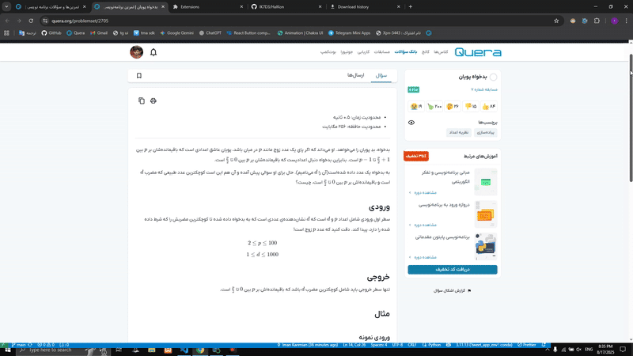

<div align="center">

<h1>⚡ CodeCruncher ⚡</h1>
<p><b>کد نهایی سوال را با یک کلیک دریافت کنید!</b></p>
<br>
<!-- دموی گیف -->



<!-- لوگو -->


</div>


#### هیولای کدخور 👹
به جای اینکه با کدهای اولیه و خسته‌کننده سر و کله بزنی، اجازه بده این هیولای بامزه اون‌ها رو برات هورت بکشه. اینطوری تو می‌تونی مغزت رو برای فهمیدن منطق اصلی مسئله آزاد بذاری و با یه کلیک، یه راه حل آماده تحویل بگیری!

#### ⚙️ نصب و راه‌اندازی

- مرحله اول: تنظیم کلید API (بسیار مهم)

_این پروژه از مدل زبان Cohere برای تولید کد استفاده می‌کند. برای اجرای سرور، شما به یک کلید API نیاز دارید._

به وب‌سایت Cohere بروید و یک حساب کاربری رایگان بسازید.

از داشبورد خود یک Trial Key (کلید آزمایشی) دریافت کنید.

در پوشه backend، یک کپی از فایل env.example بسازید و نام آن را به .env تغییر دهید.

فایل .env را باز کرده و کلید API خود را در آن قرار دهید:
```bash
GOOGLE_API_KEY="PASTE_YOUR_COHERE_API_KEY_HERE"
```
- مرحله دوم: اجرای سرور
```bash
uvicorn main:app --reload
```

- مرحله سوم: راه‌اندازي اكستنشن

مرورگر کروم را باز کرده و به آدرس chrome://extensions بروید.
در گوشه بالا سمت راست، Developer mode (حالت توسعه‌دهنده) را فعال کنید.
روی دکمه Load unpacked کلیک کنید.
پوشه اصلی پروژه (جایی که manifest.json قرار دارد) را انتخاب کنید.

مطمئن شوید که سرور بک‌اند شما در حال اجراست.

به صفحه یک سوال در سایت Quera بروید.

روی آیکون هیولای کدخور در نوار ابزار مرورگر کلیک کنید.

در پنجره باز شده، روی دکمه _حل کن!_ کلیک کنید.

منتظر بمانید تا فرآیند تکمیل شود و فایل solution.py به صورت خودکار دانلود گردد!

_آپلود کن 100 بگیر :)_

